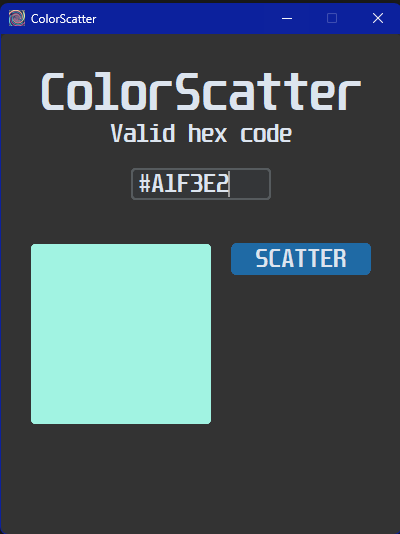
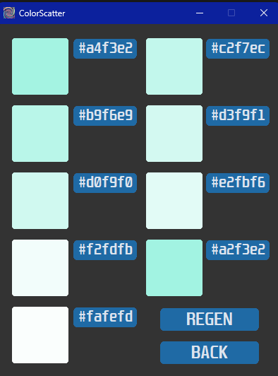

# ColorScatter

### A creative tool that can "scatter" an input color to generate various similar colors confined to user-defined parameters.

### Creation date: 2/07/2026

## Features: 

- Supports hex code colors as input.
- User can define exact boundaries for the hue, saturation, and lightness (HSL) of the colors.
- Generates randomized colors within the boundaries - user can refresh as many times as desired.
- Click-to-clipboard functionality by clicking the desired hex code.

#

## Screenshot 1: Input  

   

## Screenshot 2: Configuration  

   

## Screenshot 3: Output  

   

## How to run: 

1. Download the `ColorScatter.exe` file.
2. Double-click to run. No setup or extra files required!

*Note: If Windows Defender flags the .exe as suspicious, it is a false positive common with PyInstaller.*

## For developers:

If you want to run the Python script directly:

1. Ensure you have Python 3.x installed.
2. This project uses customtkinter - install with `pip install customtkinter`
3. Download the repository.
4. Ensure the `images` folder, `icon.ico`, `color_scatter_logic.py`, and `color_scatter_GUI.py` are in the same directory.
5. Execute the main GUI script: `color_scatter_GUI.py`

### Project Structure:

- `ColorScatter.exe`    &nbsp;&nbsp;&nbsp;&nbsp;&nbsp;# The full packaged game
- `color_scatter_GUI.py`       &nbsp;&nbsp;&nbsp;&nbsp;&nbsp;&nbsp;&nbsp;&nbsp;&nbsp;&nbsp;# Game visuals
- `color_scatter_logic.py`     &nbsp;&nbsp;&nbsp;&nbsp;&nbsp;&nbsp;&nbsp;# Game logic
- `icon.ico`    &nbsp;&nbsp;&nbsp;&nbsp;&nbsp;&nbsp;&nbsp;# App icon
- `images/`
    - `Screenshots`     &nbsp;&nbsp;&nbsp;&nbsp;&nbsp;&nbsp;&nbsp;# Screenshots from README

## What I learned:

My computer graphics class assigned an assignment related to creating an animal within Adobe Illustrator. Eventually, I realized that my choice of style for the project would require lots of individual colors to make the project look good, but fiddling around with a color picker for every individual color would be annoying - I know from past experience with many Google Slides projects. This was my solution - to have code give me a bunch of fitting hex codes automatically. 

Surprisingly, the hex and HSL conversions were the easiest part - all it took was some YouTube to learn the conversions. It was bringing that functionality to an application that was hard.

This project challenged me a lot as I had to manage an, at the time, completely unfamiliar library called customtkinter. I chose it for its naturally more appealing visuals over the standard tkinter. The worst part was figuring out how to configure the widgets to its respective logic and filling in all the gaps - it kept me up until 4 AM once. But I have prevailed, and came out with an app that I actually find useful, as well as stronger knowledge with GUIs and modularity between logic and visuals. Roughly a month in, I'm very much satisfied with this project.

## Built with:

- Language: Python
- GUI Library: customtkinter
- Packaging: PyInstaller (for the .exe creation)